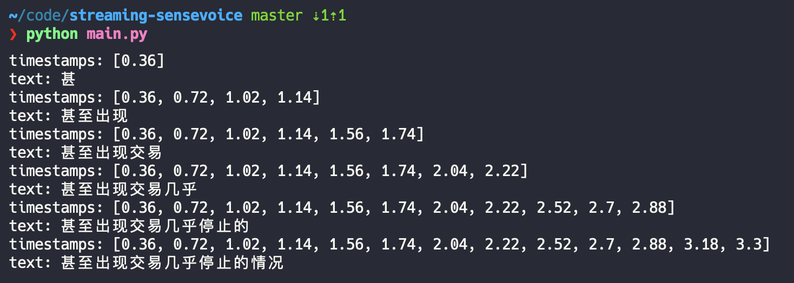

# streaming-sensevoice

Streaming SenseVoice processes inference in chunks of [SenseVoice](https://github.com/FunAudioLLM/SenseVoice).

## Usage

- transcribe wav file

``` bash
$ python main.py
```



- transcribe from microphone

``` bash
$ python realtime.py
```
